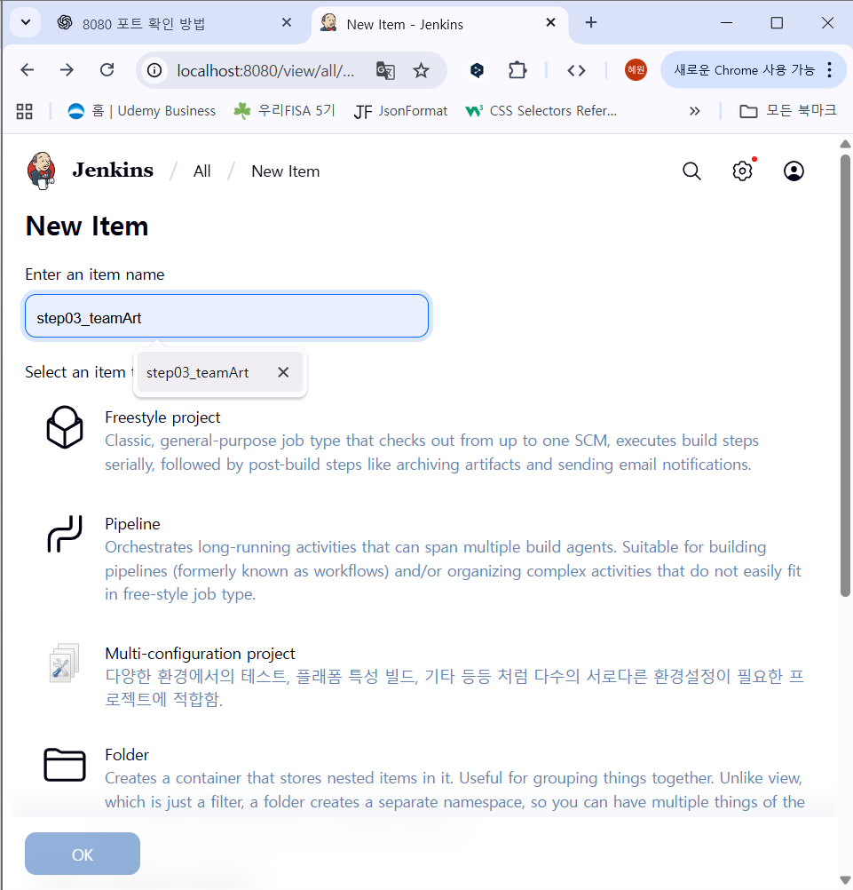

# build_gradle
gradle project jenkins에 빌드 연습

# 20250916 미션

### 상황

이미 docker 로 jenkins를 올렸고 build 할 수 있도록 설정도 변경하고 pipeline까지 생성한 상황



pipeline선택

**pipeline script**

```bash
pipeline {
    agent any
    stages {
        stage('Checkout') {
            steps {
                git branch: 'main', url: 'https://github.com/hyewon8245/build_gradle.git'
                echo "**********"
                sh 'ls -al'
                echo "**********"
            }
        }
        stage('Build') {
            steps {
                script {
                    if (fileExists('gradlew')) {
                        sh 'chmod +x gradlew'
                        sh './gradlew build'
                    } else if (fileExists('pom.xml')) {
                        sh 'mvn clean package'
                    } else {
                        error 'Gradle 또는 Maven 프로젝트가 아님'
                    }
                }
            }
        }   // ✅ stage('Build') 블록 닫기
    }
    post {
        failure {
            echo "❌ 빌드 실패! 오류 확인 필요!"
        }
        success {
            echo "✅ 빌드 성공!"
        }
    }
}


```


**save 선택**


지금 빌드 선택


잘 빌드 되면 workspaces 선택

<aside>
💡

workspace/build/libs 이동

</aside>


jar파일이 생성된 것을 확인 가능함

이미 이렇게까지 진행했던 상황

## 목표

이미 생성된 설정 파일들을 유지하면서 bind mount를 하고자 함.

→  설정되었던 파일들을 cp를 떠서 backup한 뒤에 그 백업한 데이터들을 새로 생성하는 jenkins docker 에 붙여놓을 생각을 함.

bind mount를 한 dir에는 workspace를 bindmount를 하여 도커에서의 데이터를 host에 bindmount한 폴더에 가져올 수 있도록함

```bash
docker cp myjenkins:/var/jenkins_home ./jenkins_home_backup
docker rm -f myjenkins

docker run -d -p 8080:8080 \
  -v $(pwd)/jenkins_home_backup:/var/jenkins_home \
  -v /home/ubuntu/workspace:/var/jenkins_home/workspace \
  --name myjenkins jenkins/jenkins:lts-jdk17

```

**권한 수정**

```bash
sudo chown -R 1000:1000 /home/ubuntu/workspace
#jenkins에서 접근할 수 있도록 하
```

**다시 jenkins에서 빌드 실행**


bindmount한 곳에 workspace 아래의 내용이 들어간 것을 확인 가능


<aside>
💡

/home/ubuntu/workspace/step03_teamArt/build/libs 에 jar파일을 확인 가능하다.

</aside>

```bash
java -jar step04_gradleBuild-0.0.1-SNAPSHOT.jar
```

로 실행이 가능하다.


**컨테이너를 만들어보자**


```bash
/home/ubuntu/workspace/step03_teamArt/build/libs 로 이동한 뒤
dockerfile을 생성
```

dockerfile 생성

```bash
FROM openjdk:17-jdk-slim

WORKDIR /app

# JAR 파일 복사 (파일명 확인!)
COPY step04_gradleBuild-0.0.1-SNAPSHOT.jar app.jar

EXPOSE 8088

ENTRYPOINT ["java", "-jar", "app.jar"]

```

```bash
docker build -t my-gradle-app .
docker run -d -p 8088:8088 my-gradle-app
```


<aside>
💡
실행된 걸 확인할 수 있다.

</aside>

---

## volume mount

```bash
docker volume create gradle_vol
```

```bash
docker run -d --name myjenkins \
  -p 8080:8080 -p 50000:50000 \
  -v $(pwd)/jenkins_home_backup:/var/jenkins_home \
  -v gradle_vol:/var/jenkins_home/workspace \
  jenkins/jenkins:lts-jdk17
```

### 오류

<aside>
💡

volume에 jenkins 접근 권한이 없음

</aside>

```bash
sudo chown -R 1000:1000 /var/lib/docker/volumes/gradle_vol/_data
```

**빌드 실행 후**

```bash
sudo ls -al /var/lib/docker/volumes/gradle_vol/_data
```


---

### 📌 오류 - 원래 지금 걸 유지한 상태로 volume을 mount하고 싶었다면

<aside>
💡
/jenkins_home_backup이 현재 backup파일을 모두 가지고 있음. 이걸 volume으로 옮길 것

</aside>

### 👉 정리하면 지금 상황은

- 현재 띄운 Jenkins 컨테이너가 **volume 없이 실행**되고 있고,
- `/var/jenkins_home` 은 컨테이너 내부에만 있어서 컨테이너 삭제 시 날아감,
- 그래서 **지금 데이터를 백업**해두고,
- 앞으로는 Jenkins를 킬 때 **jenkins_home volume**을 연결해서 쓰고 싶다는 얘기

---

## 📌 지금 데이터 백업하기

1. **컨테이너 이름 확인**

```bash
docker ps

```

예: `myjenkins`

2. **컨테이너 내부 `/var/jenkins_home` → tar 백업**

```bash
docker cp myjenkins:/var/jenkins_home ./jenkins_home_backup

```

→ 현재 디렉토리에 `jenkins_home_backup.tar.gz` 생김.

이 안에 Jenkins 모든 데이터(admin 계정, 플러그인, job 등) 들어있습니다.

---

## 📌 이후 Jenkins 실행 시 volume 사용

1. 새로운 volume 생성

```bash
docker volume create jenkins_home

```

2. 호스트에서 직접 백업 데이터 volume에 넣기

```bash
sudo cp -r jenkins_home_backup/* /var/lib/docker/volumes/jenkins_home/_data/
sudo chown -R 1000:1000 /var/lib/docker/volumes/jenkins_home/_data

```

3. volume에 jenkins가 접근할 수 있도록 권한 부여

```bash
sudo chown -R 1000:1000 /var/lib/docker/volumes/jenkins_home/_data 
```

4. Jenkins 컨테이너 실행 시 volume 연결 ( 또 더 원하는 volume 도 mount해서 실행도 가능하다.)

```bash
docker run -d --name myjenkins \
  -p 8080:8080 -p 50000:50000 \
  -v jenkins_home:/var/jenkins_home \
  jenkins/jenkins:lts-jdk17
```

---

✅ 이렇게 하면:

- **앞으로는 항상 jenkins_home volume에 데이터가 저장**됨
- Jenkins 컨테이너를 껐다 켜도, 심지어 삭제해도 데이터가 유지됨

---
